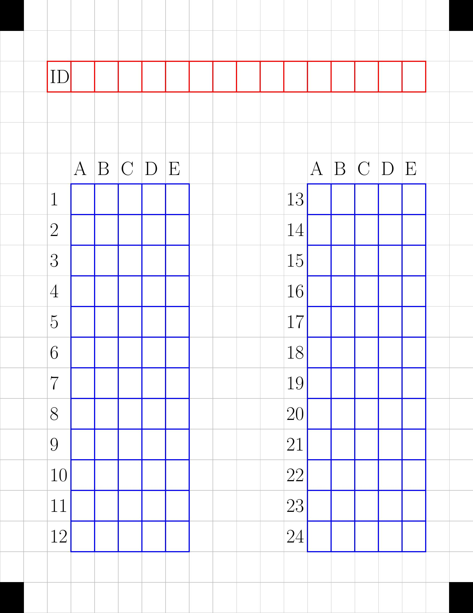
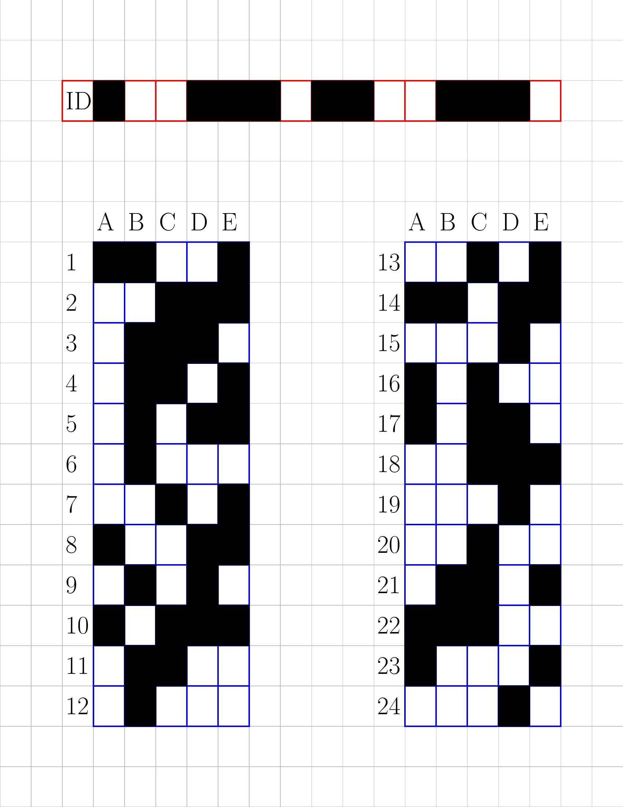
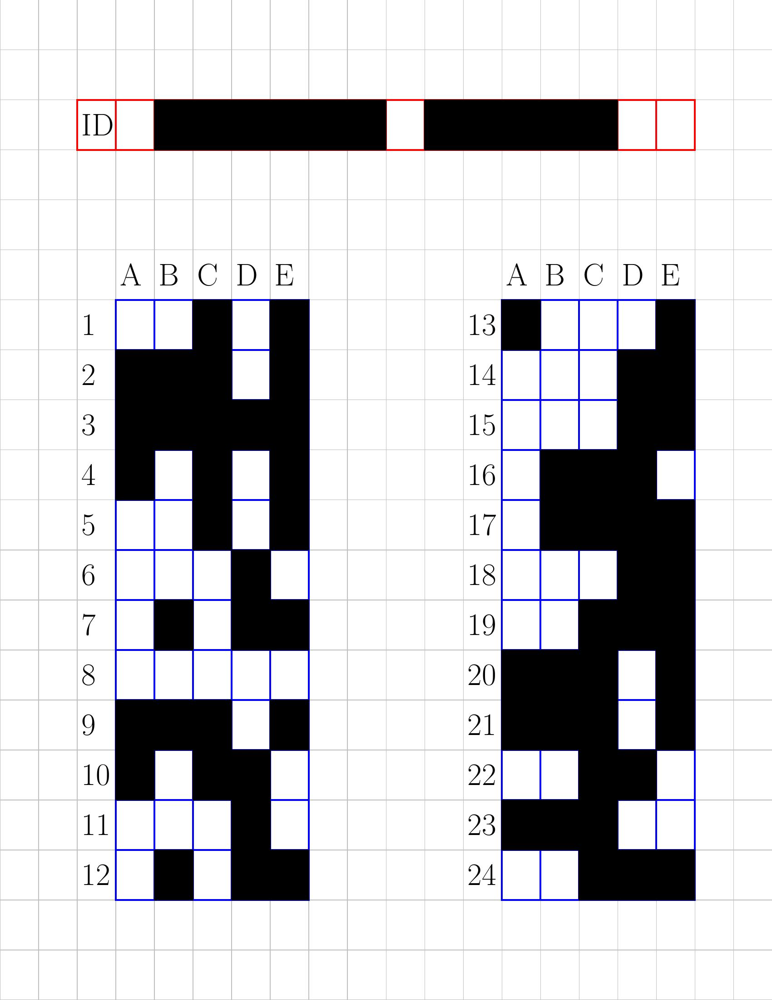

# MyOMR
This is an Optical Mark Recognition software. Its automates the grading of multiple choice questions. The aim is to make it easy to use and
require only python packages.

## Usage
* The examiner prints copies of the pdf file called "test_cases.pdf".
* The exam taker file them by blacking out appropriate cases.
* The examiner produces the solution  by blacking out appropriate cases.
* The scanned version are provided to the software
* Students Id and grades are produced by the software.

## Example

Here is a use example:
```
aModel=model2()
testImg="test.jpeg"
solImg="sol.jpeg"
res=grade(aModel,testImg,solImg)
print(res)
```

You may see the function "example()" in the module.

## Requirements
pdf2image, numpy

## Screenshots

### Form

### Example Filed form

### Example solution


